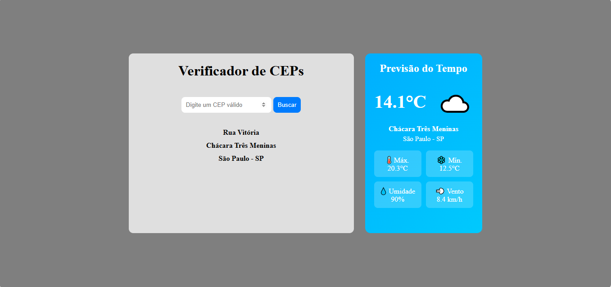

# 📍 Verificador de CEP com Previsão do Tempo

Um projeto desenvolvido com **HTML**, **CSS** e **JavaScript** que permite consultar um CEP utilizando a API do **ViaCEP** e exibir, em tempo real, a previsão do tempo da localidade através da API **Open-Meteo**.

---

## 🚀 Funcionalidades

- 🔎 Consulta de CEP em tempo real.
- 📍 Exibição do:
  - Logradouro
  - Bairro
  - Cidade
  - Estado
- 🌤️ Exibição da previsão do tempo da região:
  - Temperatura atual
  - Temperatura máxima
  - Temperatura mínima
  - Umidade
  - Velocidade do vento
  - Ícone representando o clima
- 📱 Layout responsivo para dispositivos móveis.
- 🎨 Interface moderna utilizando Flexbox e Glassmorphism no mobile.

---

## 🛠️ Tecnologias utilizadas

- HTML5
- CSS3
- JavaScript (ES6+)
- Fetch API

---

## 🌐 APIs utilizadas

### ViaCEP

Responsável por consultar os dados do endereço a partir do CEP.

https://viacep.com.br/

### Open-Meteo

Responsável pela geolocalização da cidade e pela previsão do tempo.

https://open-meteo.com/

---

## 💻 Como utilizar

1. Digite um CEP válido.
2. Clique em **Buscar**.
3. Aguarde alguns segundos.
4. O sistema exibirá:
   - Endereço correspondente ao CEP.
   - Previsão do tempo da localidade.

---

## 📱 Responsividade

O projeto foi desenvolvido para funcionar em:

- 💻 Desktop
- 📱 Smartphones
- 📟 Tablets

No modo mobile o layout é reorganizado automaticamente e utiliza um efeito de vidro (*Glassmorphism*) para integrar o card da previsão do tempo ao plano de fundo.

---

Durante o desenvolvimento deste projeto foram praticados conceitos como:

- Consumo de APIs REST
- Programação assíncrona com `async/await`
- Manipulação do DOM
- Fetch API
- Flexbox
- CSS Grid
- Responsividade
- Tratamento de erros
- Organização de código JavaScript

---

- [ ] Exibir previsão para os próximos dias.
- [ ] Mostrar sensação térmica.
- [ ] Adicionar animações na busca.
- [ ] Permitir busca utilizando a localização do usuário.
- [ ] Trocar o plano de fundo conforme o clima.
- [ ] Adicionar modo escuro.

---

## 👨‍💻 Autor

Desenvolvido por **Uberdan Almeida**.

LinkedIn: https://www.linkedin.com/in/uberdanalmeida/

GitHub: https://github.com/Uberdanalmeida