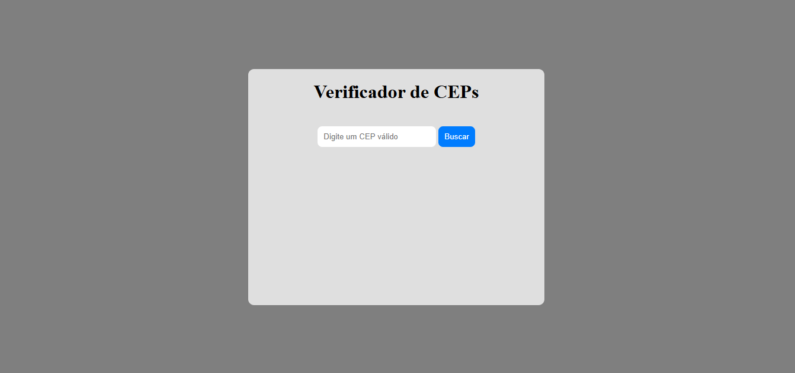

# Verificador de CEPs

Aplicação web desenvolvida com HTML, CSS e JavaScript para consulta de endereços a partir de um CEP. O projeto utiliza a API pública ViaCEP para realizar a busca e apresentar as informações de localização diretamente na página.

## Sobre o projeto

O **Verificador de CEPs** permite que o usuário informe um CEP válido e consulte seus respectivos dados de endereço.

Após a consulta, a aplicação apresenta:

- Logradouro;
- Bairro;
- Cidade;
- Estado (UF).

A interface foi desenvolvida com foco em simplicidade, organização e responsividade, permitindo a utilização tanto em computadores quanto em dispositivos móveis.

## Funcionalidades

- Consulta de CEP utilizando a API ViaCEP;
- Exibição dos dados do endereço;
- Validação de CEP não encontrado;
- Tratamento de erros durante a consulta;
- Busca utilizando o botão **Buscar**;
- Busca utilizando a tecla **Enter**;
- Limpeza automática do campo após a consulta;
- Foco automático no campo de CEP após a pesquisa;
- Layout responsivo para dispositivos móveis;
- Interface adaptada para diferentes tamanhos de tela.

## Tecnologias utilizadas

- **HTML5** — estrutura e organização da aplicação;
- **CSS3** — estilização, layout e responsividade;
- **JavaScript** — lógica da aplicação, eventos e consumo da API;
- **Fetch API** — realização das requisições HTTP;
- **ViaCEP** — API utilizada para consulta dos dados de endereço.

## API utilizada

O projeto utiliza a **ViaCEP**, uma API pública para consulta de informações de endereço através do CEP.

Endpoint utilizado:

```text
https://viacep.com.br/ws/{CEP}/json/